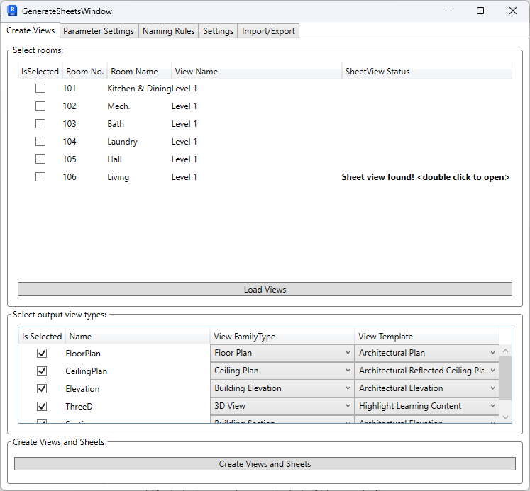

Most of above directories contain separate funtions. Each function contains its own modeless window and logic. All of them are formed in a single plug in.

Example of a function in RevitTools/GenerateSheets

Generate Sheets Tool creates plan views for each room that contains 4 elevation views, plan view, ceiling view and 3d view of selected room.

